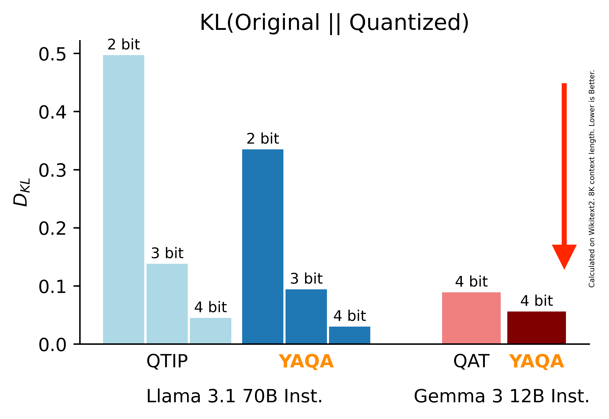

# [Model-Preserving Adaptive Rounding](https://arxiv.org/abs/2505.FIX)

This repository contains code for Yet Another Quantization Algorithm (YAQA), a quantization framework that uses a Kronecker-factored approximation of the layerwise Hessian with respect to the full-model KL divergence to better preserve model outputs after quantization.
YAQA reduces the KL divergence to the original model by a factor of 1/3 over LDLQ/GPTQ across a wide range of models and quantizers, translating to state of the art performance on downstream tasks.
For more details, see the paper.



## How to use this codebase

This codebase is based off of the [QTIP](https://github.com/Cornell-RelaxML/qtip) codebase, with modifications made to support YAQA's quantization algorithm.
To collect Hessians, see the `README` in `hessian_llama/`.
To quantize models, follow the instructions in the [QTIP codebase](https://github.com/Cornell-RelaxML/qtip).
Prequantized models and Sketch-B Hessians (see paper) can be found [here](https://huggingface.co/collections/relaxml/yaqa-6837d4c8896eb9ceb7cb899e).

## Other

If you found this work useful, please consider citing
```
@misc{tseng2024yaqa,
      title={Model-Preserving Adaptive Rounding},
      author={Albert Tseng and Zhaofeng Sun and Christopher De Sa},
      year={2025},
      eprint={2505.},
      archivePrefix={arXiv},
      primaryClass={cs.LG},
      url={https://arxiv.org/abs/}, 
}
```

Use of Llama models is governed by the Llama Community License. Use of this code is governed by the GNU GPL v3 license.
